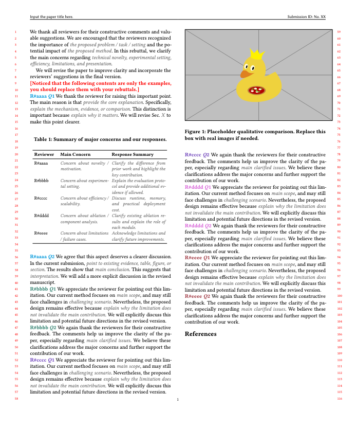

# 📝 ACM Rebuttal Template

<p align="center">
  <b>A lightweight ACM-style rebuttal template</b>
</p>

<p align="center">
  
  
  
  
</p>

<p align="center">
  🌐 <b>Language:</b>
  <a href="./README.md">English</a> |
  <a href="./README_zh.md">中文</a>
</p>

---

## ✨ Overview

This repository provides a compact ACM-style rebuttal template [Non-official] based on the `acmart` class, including ACM MM Conference. After you compile the Latex template in this repo., you will get:

<p align="center">
  
</p>

The template keeps the original ACM two-column review layout while moving the paper title and submission ID into the page header, leaving more space for rebuttal content.

---

## 🚀 Features

* ✅ ACM `sigconf` two-column layout
* ✅ Review mode with line numbers
* ✅ Anonymous submission information
* ✅ Paper title and submission ID shown in the page header
* ✅ Suppressed default `\maketitle` title/author block
* ✅ Colored reviewer/question aliases
* ✅ Separate response files for different reviewers
* ✅ Built-in TODO and placeholder commands
* ✅ Compatible with standard ACM bibliography style

---

## 📁 File Structure

`cd Latex_template` or `unzip Latex_template.zip`, A recommended project structure is:

```text
.
├── rebuttal.tex
├── sample-base.bib
├── reviewers
│   ├── reviewer1.tex
│   ├── reviewer2.tex
│   ├── reviewer3.tex
│   ├── reviewer4.tex
│   └── reviewer5.tex
├── figures
│   └── placeholder.pdf
```

The `rebuttal.tex` file controls the global ACM style, reviewer macros, header settings, bibliography, and reviewer response inputs.

---

## 🧩 Main Design

### 📌 Header-based paper information

Instead of printing the title, authors, affiliations, and submission ID through the default `\maketitle` block, this template places the title and submission ID in the page header.

Modify the following commands in `rebuttal.tex`:

```latex
\newcommand{\RebuttalTitle}{Input the paper title here.}
\newcommand{\RebuttalShortTitle}{Input the paper title here.}
\newcommand{\RebuttalID}{No. XX}
```

* `\RebuttalTitle`: full paper title.
* `\RebuttalShortTitle`: short title shown in the header.
* `\RebuttalID`: submission ID.

The template still calls `\maketitle` to preserve the internal layout initialization of `acmart`, but suppresses the printed title/author block to save rebuttal space.

---

## 🎨 Reviewer Aliases

The template defines colored reviewer aliases:

```latex
\reviewerone{1}
\reviewertwo{1}
\reviewerthree{1}
\reviewerfour{1}
\reviewerfive{1}
```

For example:

```latex
\reviewerone{2}
```

will render a colored label corresponding to:

```text
R#aaaa Q2
```

The default reviewer mapping is:

```latex
% Reviewer 1 = R#aaaa
% Reviewer 2 = R#bbbb
% Reviewer 3 = R#cccc
% Reviewer 4 = R#dddd
% Reviewer 5 = R#eeee
```

You can replace these aliases with the actual reviewer IDs from the review system.

---

## 🌈 Customizing Colors

Reviewer colors are defined using hexadecimal color values:

```latex
\definecolor{reviewerblue}{HTML}{17A1DE}
\definecolor{reviewergreen}{HTML}{549688}
\definecolor{reviewerpurple}{HTML}{7E57C2}
\definecolor{reviewerpink}{HTML}{DB70DB}
\definecolor{reviewermaroon}{HTML}{A23E48}
```

Other recommended colors:

```latex
%% Other wonderful colors:
%% 1F4E79; 4B5DFF; 008C8C; 2E7D32; F28C28; D76A03; D81B60; 4A6274;
```

To change a reviewer color, modify the corresponding `\definecolor` command. For example:

```latex
\definecolor{reviewerblue}{HTML}{1F4E79}
```

---

## ✍️ Writing Reviewer Responses

Each reviewer response is written in a separate file under the `reviewers/` directory:

```latex
\input{reviewers/reviewer1}
\input{reviewers/reviewer2}
\input{reviewers/reviewer3}
\input{reviewers/reviewer4}
\input{reviewers/reviewer5}
```

---

## 🛠️ Helper Commands

The template provides two helper commands:

```latex
\newcommand{\todo}[1]{\textcolor{red}{\textbf{[TODO:} #1\textbf{]}}}
\newcommand{\placeholder}[1]{\textcolor{gray}{\textit{#1}}}
```

Usage examples:

```latex
\todo{Add additional ablation results.}

\placeholder{technical novelty, experimental setting, efficiency}
```

Before submission, make sure all TODO and placeholder contents are replaced or removed.

---

## ⚙️ Compilation

### Option 1: `pdflatex` + `bibtex`

```bash
pdflatex main.tex
bibtex main
pdflatex main.tex
pdflatex main.tex
```

### Option 2: `latexmk`

```bash
latexmk -pdf main.tex
```

To clean auxiliary files:

```bash
latexmk -c
```

`latexmk` is recommended because it automatically handles repeated compilation and bibliography generation.

---

## 📚 Bibliography

The template uses the ACM bibliography style:

```latex
\bibliographystyle{ACM-Reference-Format}
\bibliography{sample-base}
```

Add your references to `sample-base.bib`:

```bibtex
@inproceedings{example2026method,
  title     = {An Example Method for Video Generation},
  author    = {Anonymous Author},
  booktitle = {Proceedings of the ACM Conference},
  year      = {2026}
}
```

Then cite it in the rebuttal:

```latex
As shown in prior work~\cite{example2026method}, ...
```

---

## ❗ Common Issues

### The document becomes single-column

Make sure the document class keeps the ACM conference option:

```latex
\documentclass[sigconf,screen,review,anonymous]{acmart}
```

Do not replace it with a one-column class or manually use `\onecolumn`.

### The title block appears in the main content

The template suppresses the printed title block through:

```latex
\AtBeginMaketitle{%
  \def\@mktitle{%
    \global\setbox\mktitle@bx=\vbox{}%
  }%
  \def\@mkauthors{}%
  \def\@mkteasers{}%
}
```

Make sure this block is placed before `\begin{document}` and that `\maketitle` is still called after `\begin{document}`.

### The header is not shown

Make sure the following line is not overwritten later:

```latex
\pagestyle{standardpagestyle}
```

Also ensure that the customized page styles are defined inside:

```latex
\AtBeginDocument{...}
```

### Line numbers disappear

This template preserves ACM review line numbers by keeping:

```latex
\ACM@linecountL
\ACM@linecountR
```

inside the customized `fancyhdr` page styles.

If line numbers disappear, check whether these commands were accidentally removed.

### Header title is too long

Use a shorter title for the header:

```latex
\newcommand{\RebuttalShortTitle}{Short Paper Title}
```

The full title can still be kept in:

```latex
\newcommand{\RebuttalTitle}{Full Paper Title}
```

---

## ✅ Submission Checklist

Before submitting the rebuttal, please check the following items:

* [ ] Replace the paper title.
* [ ] Replace the short title.
* [ ] Replace the submission ID.
* [ ] Replace all reviewer aliases with the correct reviewer IDs.
* [ ] Remove or resolve all `\todo{}` commands.
* [ ] Remove all placeholder text.
* [ ] Check whether the rebuttal satisfies the page limit.
* [ ] Check whether the final PDF keeps the two-column ACM review format.
* [ ] Check whether line numbers are correctly displayed.
* [ ] Check whether the bibliography is correctly compiled.
* [ ] Make sure all figures and tables are readable.

---

## 📌 Notes

This template is intended to minimally modify the original ACM style while improving space efficiency for rebuttal writing.

The main design choice is to keep `\maketitle` for ACM internal layout initialization, but suppress the printed title/author block and move essential submission information to the page header.

Before final submission, always verify the generated PDF against the official rebuttal requirements of the target conference.

---

## 📄 License

You may freely use, modify, and distribute this template for academic rebuttal writing.
