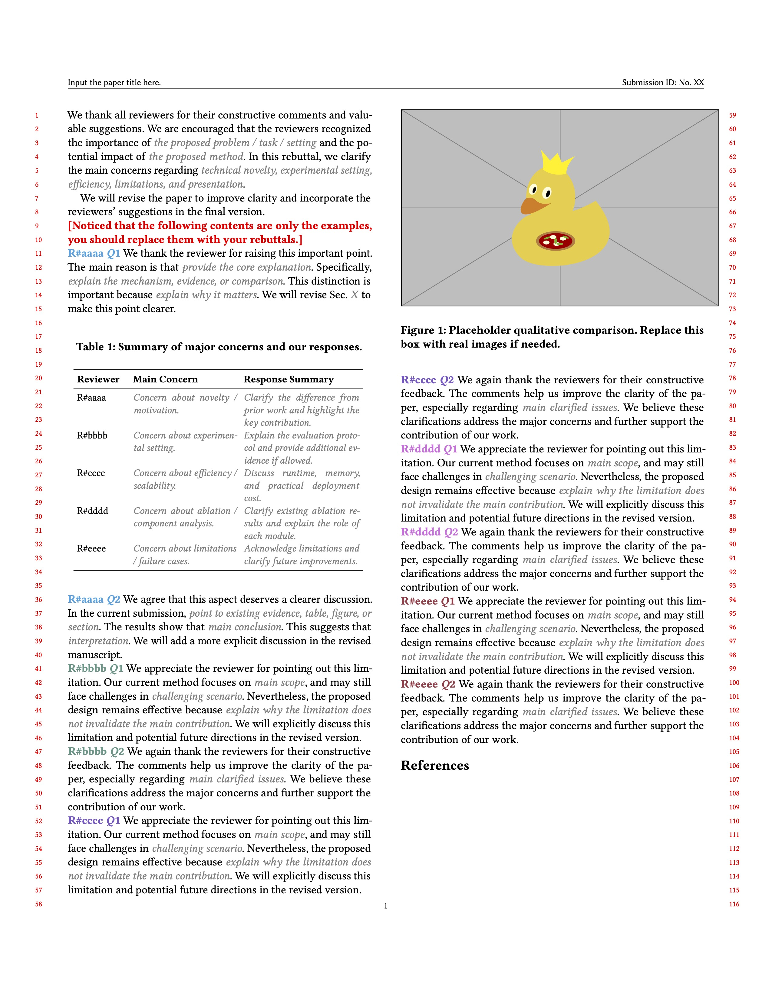

# 📝 ACM Rebuttal 模板

<p align="center">
  <b>ACM 风格 Rebuttal 模板</b>
</p>

<p align="center">
  
  
  
  
</p>

<p align="center">
  🌐 <b>语言版本：</b>
  <a href="./README.md">English</a> |
  <a href="./README_zh.md">中文</a>
</p>

---

## ✨ 简介

本仓库提供了一个基于 `acmart` 类的 ACM 风格 rebuttal 模板 [非官方]，用于包括ACM MM会议的Rebuttal。编译后效果：

<p align="center">
  
</p>

该模板保留原始 ACM 双栏 review 格式，同时将论文标题和投稿编号移动到页眉中，从而节省正文空间，便于在严格页数限制下撰写 rebuttal。

---

## 🚀 我们支持

* ✅ 保留 ACM `sigconf` 双栏格式
* ✅ 支持 review 模式和行号
* ✅ 支持匿名投稿信息
* ✅ 在页眉中显示论文标题和投稿编号
* ✅ 隐藏默认 `\maketitle` 生成的标题/作者区域
* ✅ 支持不同颜色的 reviewer/question 标签
* ✅ 每个 reviewer 的回复可以单独写在不同文件中
* ✅ 提供 TODO 和 placeholder 辅助命令
* ✅ 兼容 ACM 默认参考文献格式

---

## 📁 Latex文件结构

`cd Latex_template` or `unzip Latex_template.zip`, 推荐的项目结构如下：

```text
.
├── rebuttal.tex
├── sample-base.bib
├── reviewers
│   ├── reviewer1.tex
│   ├── reviewer2.tex
│   ├── reviewer3.tex
│   ├── reviewer4.tex
│   └── reviewer5.tex
├── figures
│   └── placeholder.pdf

```

其中，`rebuttal.tex` 负责全局 ACM 样式、reviewer 宏定义、页眉设置、参考文献以及各个 reviewer 回复文件的导入。

---

## 🧩 如何使用？

### 📌 将论文信息放入页眉

该模板不再通过默认的 `\maketitle` 在正文区域打印标题、作者、机构和投稿编号，而是将标题和投稿编号放入页眉中。

请在 `rebuttal.tex` 中修改以下命令：

```latex
\newcommand{\RebuttalTitle}{Input the paper title here.}
\newcommand{\RebuttalShortTitle}{Input the paper title here.}
\newcommand{\RebuttalID}{No. XX}
```

含义如下：

* `\RebuttalTitle`：完整论文标题。
* `\RebuttalShortTitle`：显示在页眉中的短标题。
* `\RebuttalID`：投稿编号。

模板仍然保留 `\maketitle`，这是为了让 `acmart` 完成内部版式初始化；同时，通过重定义相关命令抑制默认标题和作者区域的显示，从而节省 rebuttal 空间。

---

## 🎨 Reviewer 标签

模板为不同 reviewer 定义了不同颜色的标签：

```latex
\reviewerone{1}
\reviewertwo{1}
\reviewerthree{1}
\reviewerfour{1}
\reviewerfive{1}
```

例如：

```latex
\reviewerone{2}
```

会显示为类似下面的彩色标签：

```text
R#aaaa Q2
```

默认 reviewer 映射关系如下：

```latex
% Reviewer 1 = R#aaaa
% Reviewer 2 = R#bbbb
% Reviewer 3 = R#cccc
% Reviewer 4 = R#dddd
% Reviewer 5 = R#eeee
```

你可以根据评审系统中的真实 reviewer ID 替换这些别名。

---

## 🌈 自定义颜色

Reviewer 颜色通过十六进制颜色值定义：

```latex
\definecolor{reviewerblue}{HTML}{17A1DE}
\definecolor{reviewergreen}{HTML}{549688}
\definecolor{reviewerpurple}{HTML}{7E57C2}
\definecolor{reviewerpink}{HTML}{DB70DB}
\definecolor{reviewermaroon}{HTML}{A23E48}
```

模板中也提供了一些备用颜色：

```latex
%% Other wonderful colors:
%% 1F4E79; 4B5DFF; 008C8C; 2E7D32; F28C28; D76A03; D81B60; 4A6274;
```

如果想修改某个 reviewer 的颜色，只需要修改对应的 `\definecolor` 命令。例如：

```latex
\definecolor{reviewerblue}{HTML}{1F4E79}
```

---

## ✍️ 撰写 Reviewer 回复

每个 reviewer 的回复建议单独写在 `reviewers/` 文件夹下：

```latex
\input{reviewers/reviewer1}
\input{reviewers/reviewer2}
\input{reviewers/reviewer3}
\input{reviewers/reviewer4}
\input{reviewers/reviewer5}
```

---

## 🛠️ 辅助命令

模板提供了两个辅助命令：

```latex
\newcommand{\todo}[1]{\textcolor{red}{\textbf{[TODO:} #1\textbf{]}}}
\newcommand{\placeholder}[1]{\textcolor{gray}{\textit{#1}}}
```

使用示例：

```latex
\todo{Add additional ablation results.}

\placeholder{technical novelty, experimental setting, efficiency}
```

提交前，请务必删除或替换所有 TODO 和 placeholder 内容。

---

## ⚙️ 编译方式

### 方式一：`pdflatex` + `bibtex`

```bash
pdflatex main.tex
bibtex main
pdflatex main.tex
pdflatex main.tex
```

### 方式二：`latexmk`

```bash
latexmk -pdf main.tex
```

清理辅助文件：

```bash
latexmk -c
```

推荐使用 `latexmk`，因为它可以自动处理多次编译和参考文献生成。

---

## 📚 参考文献

模板使用 ACM 默认参考文献格式：

```latex
\bibliographystyle{ACM-Reference-Format}
\bibliography{sample-base}
```

你可以将参考文献添加到 `sample-base.bib` 中：

```bibtex
@inproceedings{example2026method,
  title     = {An Example Method for Video Generation},
  author    = {Anonymous Author},
  booktitle = {Proceedings of the ACM Conference},
  year      = {2026}
}
```

然后在 rebuttal 中引用：

```latex
As shown in prior work~\cite{example2026method}, ...
```

---

## ❗ 常见问题

### 文档变成了单栏

请确认文档类仍然使用 ACM conference 选项：

```latex
\documentclass[sigconf,screen,review,anonymous]{acmart}
```

不要替换成单栏文档类，也不要手动使用 `\onecolumn`。

### 默认标题区域仍然出现在正文中

模板通过以下代码抑制默认标题区域：

```latex
\AtBeginMaketitle{%
  \def\@mktitle{%
    \global\setbox\mktitle@bx=\vbox{}%
  }%
  \def\@mkauthors{}%
  \def\@mkteasers{}%
}
```

请确保该代码位于 `\begin{document}` 之前，并且 `\maketitle` 仍然在 `\begin{document}` 之后调用。

### 页眉没有显示

请确认以下设置没有被后续代码覆盖：

```latex
\pagestyle{standardpagestyle}
```

同时，请确保自定义页眉样式被写在：

```latex
\AtBeginDocument{...}
```

之中。

### 行号消失

该模板通过保留下面两个命令来维持 ACM review 模式下的行号：

```latex
\ACM@linecountL
\ACM@linecountR
```

如果行号消失，请检查这两个命令是否被误删。

### 页眉标题过长

如果页眉中的标题太长，可以使用较短的标题：

```latex
\newcommand{\RebuttalShortTitle}{Short Paper Title}
```

完整标题仍然可以保留在：

```latex
\newcommand{\RebuttalTitle}{Full Paper Title}
```

---

## ✅ 提交前检查清单

提交 rebuttal 前，建议检查以下内容：

* [ ] 是否替换了论文标题。
* [ ] 是否替换了页眉短标题。
* [ ] 是否替换了投稿编号。
* [ ] 是否将 reviewer 别名替换为真实 reviewer ID。
* [ ] 是否删除或处理了所有 `\todo{}`。
* [ ] 是否删除了所有 placeholder 文本。
* [ ] 是否满足 rebuttal 页数限制。
* [ ] 最终 PDF 是否保持 ACM 双栏 review 格式。
* [ ] 行号是否正常显示。
* [ ] 参考文献是否正确编译。
* [ ] 所有图表是否清晰可读。

---

## 📌 说明

该模板的目标是在尽量少修改 ACM 原始样式的前提下，提高 rebuttal 写作时的空间利用率。

核心设计是：保留 `\maketitle` 用于 ACM 内部版式初始化，但隐藏默认标题/作者区域，并将必要的投稿信息移动到页眉中。

最终提交前，请务必根据目标会议的官方 rebuttal 要求检查生成的 PDF。

---

## 📄 License

You may freely use, modify, and distribute this template for academic rebuttal writing.
